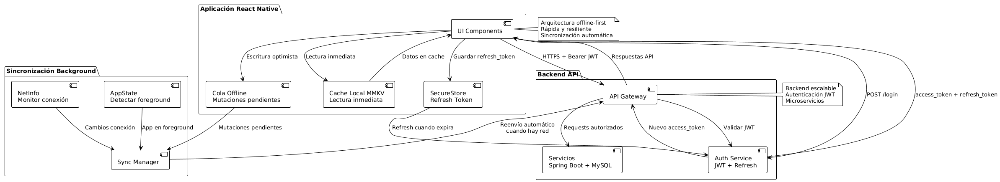

# Prueba Técnica FullStack – Juan Mera

Aplicación móvil completa de gestión de tareas desarrollada con **React Native CLI (bare workflow)** + backend Spring Boot.

## Videos de demostración

[Ver los vídeos de funcionamiento – Google Drive](https://drive.google.com/drive/folders/1D6jniaXgBmtSdgvmQM6vEhrd8c2et-5A?usp=drive_link)

## Tabla de contenidos

- [Estructura del proyecto](#estructura-del-proyecto)
- [Ejecución del proyecto](#ejecución-del-proyecto)
- [Respuestas técnicas](#respuestas-técnicas)
- [Autor](#autor)

## Estructura del proyecto
>**Nota Importante:**
>Al momento de desplegarlo, asegurarse de tener el backend desplegado con anterioridad

| Carpeta                               | Descripción                                                      | Enlace                                      |
|---------------------------------------|------------------------------------------------------------------|---------------------------------------------|
| [`exercises/`](exercises)             | 3 ejercicios algorítmicos en TypeScript                          | [Ver carpeta](exercises)                    |
| [`task_async_front/`](task_async_front) | App móvil **React Native CLI** – UI, navegación, API y offline | [README frontend](task_async_front/README.md) |
| [`task_sync_back/`](task_sync_back)   | Backend Spring Boot – API REST + MySQL + JWT                     | [README backend](task_sync_back/README.md)  |

## Ejecución del proyecto

Cada módulo tiene su propio README con instrucciones detalladas:

- [Frontend – task_async_front](task_async_front/README.md)
- [Backend – task_sync_back](task_sync_back/README.md)
- [Ejercicios – exercises](exercises/README.md)

**Requisitos previos**
- Node.js ≥ 16
- Java 21
- MySQL 8
- Android Studio y/o Xcode
- Yarn o npm

## Respuestas técnicas

### 1.1 React / React Native

**1. Diferencia entre useEffect, useMemo y useCallback:**

- **useEffect**: Para efectos secundarios (llamadas API, suscripciones). Se ejecuta después del renderizado.
- **useMemo**: Para memoizar cálculos costosos. Cachea el resultado de una función.
- **useCallback**: Para memoizar funciones y evitar recreaciones innecesarias.

En móviles useMemo y useCallback son cruciales para evitar renders innecesarios y mejorar el rendimiento, especialmente en listas grandes.

**2. Manejo de:**

- **Cache de datos**: Con React Query, usar ` allowableTime` y `cacheTime` para controlar la frescura de datos.
- **Sincronización offline → online**: Implementar un sistema de cola de peticiones fallidas y reenviarlas cuando se recupere la conexión.
- **Prevención de doble request**: Usar `useEffect` con cleanup, cancelación de peticiones con AbortController, o estados de loading.

**3. Expo vs React Native CLI:**

- **Expo**: Más rápido para empezar, maneja builds automáticos, pero menos flexibilidad con native modules.
- **RN CLI**: Mayor control, acceso directo a código nativo, pero configuración más compleja.

**Para proyecto productivo**: Expo con **development builds** para tener acceso a native modules manteniendo la facilidad de deployment.

**Nota del proyecto**: En esta prueba se utilizó **React Native CLI (bare workflow)** para tener control total sobre el entorno nativo.

**4. Optimización en React Native:**

- **Listas**: VirtualizedList o FlashList para listas grandes.
- **Navegación**: Lazy loading de pantallas, memoización de componentes.
- **Bundle**: Code splitting, tree shaking, usar Hermes.
- **Imágenes**: Optimizar tamaños, usar formatos WebP, lazy loading.

### 1.2 Arquitectura y Backend

**5. Arquitectura simple propuesta**  

La arquitectura propuesta es simple, consta de la aplicación React Native la cual se comunica mediante HTTP con un API. La autenticación se basa en JWT con refresh tokens, guardando el refresh token de forma segura en Keychain/SecureStore y renovando automáticamente el access token cuando expira.  
Para mejorar la experiencia offline y la velocidad, la app mantiene un caché local con MMKV donde lee datos de forma inmediata y escribe mutaciones de forma optimista; las operaciones que fallan por falta de conexión se encolan y se reenvían automáticamente en background en cuanto la red vuelve, usando NetInfo y AppState. De esta forma se consigue que la app sea rápida, no sea vulnerable a cortes de conexión y con una backend fácil de escalar.

**7. CI/CD para React Native:**

- **EAS Build**: Configurar builds para diferentes entornos (dev, staging, prod)
- **Fastlane**: Automatización de deployment a stores
- **GitHub Actions**: Pipeline de tests, linting y builds automáticos
- **Code signing**: Gestión automática de certificados

## Autor

**Juan Mera**  
FullStack Developer – React Native CLI & Spring Boot

28 de noviembre de 2025